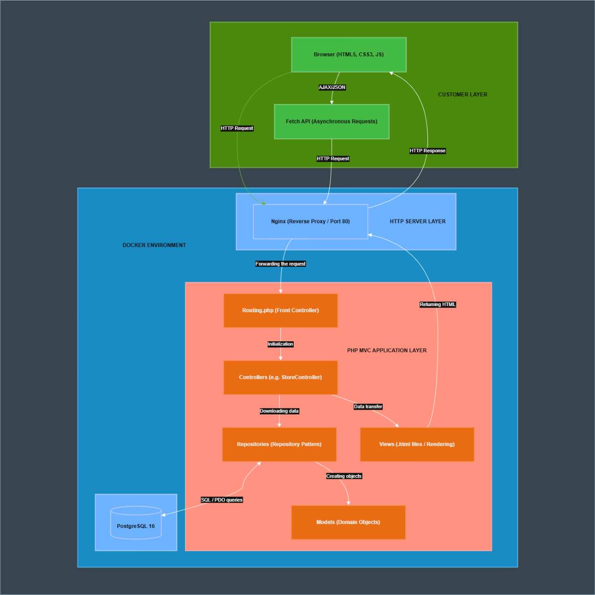
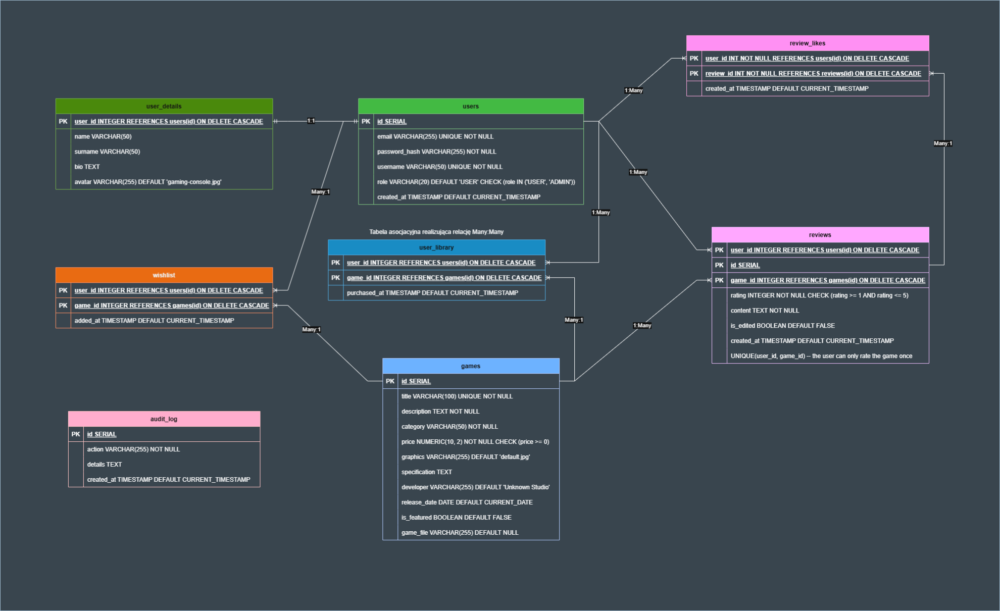

# GameNest - Digital Game Distribution Platform

[](https://www.php.net/)
[](https://www.postgresql.org/)
[](https://www.docker.com/)
[](https://developer.mozilla.org/en-US/docs/Web/JavaScript)
[](https://developer.mozilla.org/en-US/docs/Web/HTML)
[](https://developer.mozilla.org/en-US/docs/Web/CSS)
[](https://phpunit.de/)
[](https://en.wikipedia.org/wiki/Model%E2%80%93view%E2%80%93controller)

A modern e-commerce web application for game distribution, built from scratch using Pure PHP (No Frameworks) following Object-Oriented Programming (OOP) principles, SOLID, and the MVC architecture. The project is fully containerized using Docker.

---

## Table of Contents
1. [Project Overview & Live Demo](#1-project-overview--live-demo)
2. [Key Features](#2-key-features)
3. [Technologies and Patterns](#3-technologies-and-patterns)
4. [Application Architecture](#4-application-architecture)
5. [Database Schema and Logic](#5-database-schema-and-logic)
6. [Getting Started (Installation)](#6-getting-started-installation)
7. [Test Scenarios](#7-test-scenarios)
8. [Error Handling and Testing](#8-error-handling-and-testing)
9. [Project Requirements Checklist](#9-project-requirements-checklist)

---

## 1. Project Overview & Live Demo
GameNest is a comprehensive platform where users can discover, review, and manage their personal game libraries. It features a robust permission system, an administrative dashboard for inventory management, and a high-performance database layer.

**Live Environment:** The project has been deployed to a production environment.
- **Live Demo:** [gamenest.com.pl](https://gamenest.com.pl)

---

## 2. Key Features & Capabilities
- **Real File Distribution:** Users can not only browse but actually download physical game files (`.exe`, `.zip`) for titles they own, directly from the platform's secure storage.
- **Dynamic Store & Search:** Real-time, asynchronous filtering (by category, price) and sorting capabilities powered by the Fetch API, delivering a seamless SPA-like (Single Page Application) experience.
- **Interactive Review System:** Users can write, edit, and rate games (1-5 stars). The system includes a community aspect where users can "like" helpful reviews.
- **Personalized Library & Wishlist:** Track purchased games and add upcoming or unowned titles to a personal wishlist for future reference.
- **Role-Based Access Control (RBAC):** Strict separation of privileges. Standard users manage their libraries, while Administrators have access to a dedicated dashboard.
- **Administrative Dashboard:** Full CRUD operations for managing the store's inventory, user accounts, and monitoring the system via an automated Audit Log.
- **Secure Authentication:** Robust registration and login system with BCRYPT password hashing and secure session management.

---

## 3. Technologies and Patterns
The project emphasizes technical excellence and adherence to modern software engineering standards:

| Layer/Category | Technologies & Tools |
| :--- | :--- |
| **Backend** | PHP 8.3 (Strictly OOP, PDO) |
| **Frontend** | HTML5, CSS3 (Custom Flexbox/Grid), Vanilla JS (Fetch API) |
| **Database** | PostgreSQL 16 (PL/pgSQL, Triggers, Views) |
| **Infrastructure** | Docker, Docker Compose, Nginx (Reverse Proxy) |
| **Testing Tools** | PHPUnit, Bash scripts (cURL integration) |
| **Version Control** | GIT, GitHub |

- **Design Patterns:**
    - **MVC (Model-View-Controller):** Complete separation of business logic, data models, and UI templates.
    - **Repository Pattern:** Abstraction layer for database operations to ensure code maintainability.
    - **Front Controller:** Custom routing system managed via `Routing.php`.  
    [View implementation here](https://github.com/zephir-x/game-store/blob/main/Routing.php#L12)

---

## 4. Application Architecture
The application follows a layered architecture. Each request is intercepted by the Front Controller, authenticated by the Security Controller, and then dispatched to specific domain controllers.



### Directory Structure Highlights
The project enforces a strict separation of concerns, keeping core application logic inaccessible from the public web directory:
```text
game-store/
├── docker/              # Container configurations (Nginx, PHP, DB)
├── public/              # Publicly accessible directory (Document Root)
│   ├── resources/       # Assets, images, and downloadable game files
│   ├── scripts/         # Vanilla JS files (Fetch API logic)
│   ├── styles/          # Modular CSS files
│   └── views/           # HTML templates (rendered by controllers)
├── src/                 # Core application logic (Protected)
│   ├── controllers/     # Application flow & request handling
│   ├── models/          # Domain entities
│   └── repository/      # Database interaction (PDO)
├── tests/               # PHPUnit and Bash integration tests
└── Routing.php          # Front Controller mapping URLs to Controllers
```

---

## 5. Database Schema and Logic
The database was designed according to the Third Normal Form (3NF) to eliminate data redundancy and anomalies. It utilizes relational integrity with foreign keys and cascaded deletions.



**Relational Source:** [Link to draw.io source file](public/resources/diagram-erd.drawio)

### Database Highlights:
- **Relationships:**
    - **1:1:** `users` <-> `user_details` (User profile data).
    - **1:N:** `users` <-> `reviews`, `games` <-> `reviews`.
    - **N:M:** `users` <-> `user_library` and `wishlist` (Implemented via association tables).
- **Views (JOIN usage):**
    - `v_user_library_details`: Merges user data with owned games and purchase dates.
    - `v_game_statistics`: Dynamically calculates average ratings and review counts per game.
- **Triggers and Functions:**
    - `log_user_deletion()`: A PL/pgSQL function that captures user deletion metadata.
    - `after_user_delete`: A trigger that automatically populates the `audit_log` table for security monitoring.
- **Transactions:** Critical operations use PDO transactions (`beginTransaction`, `commit`, `rollback`) to ensure data consistency.  
[View example transaction implementation here](https://github.com/zephir-x/game-store/blob/main/src/repository/UserRepository.php#L160)

---

## 6. Getting Started (Installation)

### Prerequisites
- Docker and Docker Compose installed on your machine.

### Installation Steps
##### 1. Clone the repository:
   ```bash
   git clone https://github.com/zephir-x/game-store.git
   cd game-store
   ```
##### 2. Configure Environment Variables:
- Create a .env file based on .env.example
```bash
   cp .env.example .env
```
##### 3. Build and Start Containers:
- Create a .env file based on .env.example
```bash
   docker compose up -d --build
```
##### 4. Access the application:
- Web: http://localhost:8080
- Database: Accessible via the port defined in your `.env`

---

## 7. Test Scenarios
To verify the application's functionality, follow these steps:

**Credentials:**
- **Admin:** `admin@gmail.com` | Password: `admin123`
- **User 1:** `user1@gmail.com` | Password: `user1`
- **User 2:** `user2@gmail.com` | Password: `user2`
- **User 3:** `user3@gmail.com` | Password: `user3`

**Steps:**
1. **Security Check:** Log in as a standard User. Manually navigate to `/admin`. The system should block access and return a **403 Forbidden** error.  
[View authorization logic here](https://github.com/zephir-x/game-store/blob/main/src/controllers/AppController.php#L29)
2. **Dynamic Store:** Use the filter and sort controls on the Store page. Observe the content updates without a page refresh.
3. **Admin CRUD:** Log in as an Admin. Create a new game, edit its price, and then delete it.
4. **Trigger Verification:**
   - Delete a test user account from the Admin panel.
   - Navigate to the "System Audit Logs" section to confirm the automated entry generated by the database trigger.
5. **Responsiveness:** Open the browser's developer tools and toggle device simulation (Mobile). Verify that buttons and cards adjust correctly.

---

## 8. Error Handling and Testing
- **Global Error Handling:** Custom templates for HTTP status codes **400, 403, 404, and 500**.  
[View error handling pages here](https://github.com/zephir-x/game-store/blob/main/public/views/errors/)
- **Unit Testing:** PHPUnit tests for core logic and models (`tests/UserTest.php`).
- **Integration Testing:** A bash/curl script (`tests/integration.sh`) that verifies API endpoints and response codes.
- **How to run this tests:**
1. **Install PHPUnit dependencies via Composer:**
   ```bash
   docker compose exec php composer install
   ```
2. **Run PHPUnit tests (Unit/Integration for Models):**
   ```bash
   docker compose exec php ./vendor/bin/phpunit tests
   ```
3. **Run Bash Integration Tests (API/Endpoints):**
   ```bash
   bash tests/integration.sh
   ```

---

## 9. Project Requirements Checklist

| Development Area | Fulfilled Requirements |
| :--- | :--- |
| **Architecture & Code** | ✔️ Object-Oriented PHP 8.3 (No frameworks)<br>✔️ MVC Architecture Implementation<br>✔️ Adherence to SOLID principles |
| **Database (PostgreSQL)** | ✔️ 3NF Adherence & Data Integrity<br>✔️ Database Relations (1:1, 1:N, N:M)<br>✔️ SQL Views with multi-table JOINs<br>✔️ PL/pgSQL Function and Trigger<br>✔️ Transaction handling (PDO) |
| **Security & Routing** | ✔️ Secure Authentication & Sessions<br>✔️ RBAC (User and Admin roles)<br>✔️ Custom error pages (403, 404, 500) |
| **Frontend Layer** | ✔️ Modern UI (HTML5, CSS3, JavaScript)<br>✔️ Responsive Web Design (Media Queries) |
| **DevOps & Quality** | ✔️ Dockerization & Environment (.env)<br>✔️ Version Control (GIT)<br>✔️ Automated Tests (PHPUnit & Bash)<br>✔️ ERD and Architecture Diagrams |